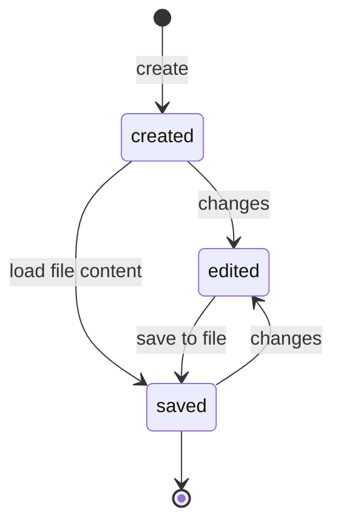

every window has a state machine that handles the state of the window.

when the window is created, it is in the `created` state.
when the window is opened with a file, it is in the `saved` state.
when user do changes to the canvas, the window is in the `edited` state.

the diagrams below show the state transitions:

