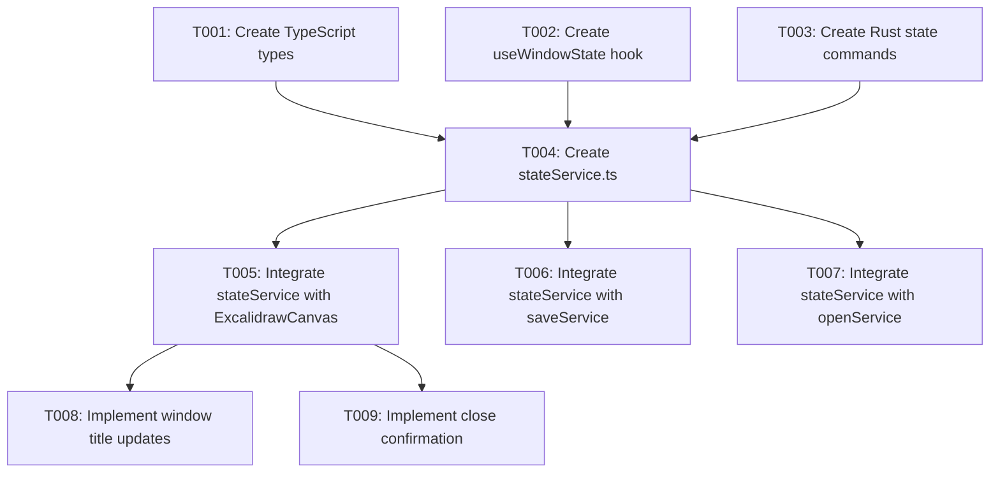

# Implementation Tasks: Window State Machine

**Feature**: Window State Machine | **Feature Number**: 004 | **Date**: 2024-12-21
**Spec**: [spec.md](spec.md) | **Plan**: [plan.md](plan.md)

## Overview

Implement a window state machine for the Excalidraw Tauri desktop application. Each window tracks its save state (created/saved/edited) with visual indicators in the title, state-aware save behavior, and close confirmation for unsaved changes.

## Tech Stack

- **Frontend**: TypeScript 5.6, React 18, @tauri-apps/api
- **Backend**: Rust edition 2024, Tauri v2
- **Storage**: In-memory per window (no persistence across restart)
- **Testing**: TypeScript compilation (`pnpm tsc`), Rust cargo check (`cargo check`)

## Dependencies

### Cross-Story Dependencies

### User Story Completion Order

- **Phase 1 (Setup)**: Types, Hook, Rust Commands
- **Phase 2 (Integration)**: Service integration with existing save/open services
- **Phase 3 (US1-4)**: Core state machine functionality
- **Phase 4 (US5-6)**: Multiple windows and close confirmation
- **Phase 5 (Polish)**: Performance optimization and cross-cutting concerns

---

## Phase 1: Setup

**Goal**: Create foundational types, hooks, and Rust commands for window state management.

### Independent Test Criteria

- TypeScript types compile without errors
- Rust commands compile without errors
- All new files are created at specified paths

### Implementation Tasks

- [x] T001 Create WindowStateType enum and WindowState interface in `src/types/windowState.ts`
- [x] T002 [P] Create useWindowState React hook in `src/hooks/useWindowState.ts`
- [x] T003 [P] Create Rust state commands in `src-tauri/src/commands/state_commands.rs`
- [x] T004 Register Rust commands in `src-tauri/src/lib.rs`

---

## Phase 2: Foundational Integration

**Goal**: Integrate stateService with existing services (saveService, openService) and ExcalidrawCanvas.

### Independent Test Criteria

- stateService can be imported and initialized
- saveService correctly calls setSaved() after save
- openService correctly calls setSaved() after opening file
- ExcalidrawCanvas correctly calls setEdited() on canvas changes

### Implementation Tasks

- [x] T005 [P] Create stateService.ts in `src/services/stateService.ts`
- [x] T006 [P] Integrate stateService with saveService.ts - call setSaved() after successful save
- [x] T007 [P] Integrate stateService with openService.ts - call setSaved() after opening file
- [x] T008 [P] Integrate useWindowState hook with ExcalidrawCanvas.tsx for state management

---

## Phase 3: Core State Machine (US1-4)

**Goal**: Implement core state machine functionality with visual indicators.

**User Stories**:
- US1: New Window State (created state with "Untitled" title)
- US2: Opening a File (saved state with filename)
- US3: Editing Changes (edited state with "*" indicator)
- US4: Saving Edited Window (transition back to saved)

### Independent Test Criteria (US1)

- New window shows "Untitled" title
- First save triggers file dialog
- State transitions to "saved" after successful save

### Independent Test Criteria (US2)

- Opened window shows filename in title
- Save uses existing path (no dialog)
- State is "saved" after opening

### Independent Test Criteria (US3)

- Changes trigger state transition to "edited"
- Title shows unsaved indicator (*)
- Unsaved indicator clears after save

### Independent Test Criteria (US4)

- Save clears unsaved indicator
- State transitions to "saved"
- Subsequent saves use same file path

### Implementation Tasks

- [x] T009 [US1] Implement window title update function based on state in `src/hooks/useWindowState.ts`
- [x] T010 [US1] Update ExcalidrawCanvas.tsx to set initial state to "created" on mount
- [x] T011 [US2] Update openService.ts to call setSaved() with file path after opening file
- [x] T012 [US3] Update ExcalidrawCanvas.tsx handleChange to call setEdited() instead of markUnsaved()
- [x] T013 [US4] Update saveService.ts to call setSaved() after successful save operation
- [x] T014 [P] [US3] Add modification marker (*) to window title when in edited state

---

## Phase 4: Multiple Windows & Close Confirmation (US5-6)

**Goal**: Support multiple independent windows and close confirmation dialog.

**User Stories**:
- US5: Multiple Windows (independent state per window)
- US6: Close Window with Unsaved Changes (native dialog)

### Independent Test Criteria (US5)

- Each window has independent state
- Save shortcuts affect only focused window
- Unsaved indicators are per-window

### Independent Test Criteria (US6)

- Close prompt appears for edited windows
- Prompt allows save, discard, or cancel
- No prompt for saved windows

### Implementation Tasks

- [x] T015 [US5] Ensure Rust state commands use window label for state isolation
- [x] T016 [US5] Update stateService to track state per window label
- [x] T017 [US6] Create confirm_close_with_unsaved Rust command with native dialog
- [x] T018 [US6] Register close confirmation command in `src-tauri/src/lib.rs`
- [x] T019 [US6] Integrate close handler with Tauri window close event

---

## Phase 5: Polish & Cross-Cutting Concerns

**Goal**: Performance optimization, testing, and documentation.

### Independent Test Criteria

- State transition completes within 100ms
- Title updates within 1 second
- Zero state corruption across 100+ window operations
- TypeScript compilation passes
- Rust cargo check passes

### Implementation Tasks

- [x] T020 [P] Run TypeScript type check (`pnpm tsc --noEmit`)
- [x] T021 [P] Run Rust cargo check (`cargo check`)
- [x] T022 [P] Test state transitions manually for all user stories
- [x] T023 [P] Verify performance meets success criteria (state transition <100ms, title update <1s)

---

## Implementation Strategy

### MVP Scope (Phase 3)

The minimum viable product includes:
- US1: New Window State (created state with "Untitled" title)
- US2: Opening a File (saved state with filename)
- US3: Editing Changes (edited state with "*" indicator)

This provides immediate value: users can see the state of each window and understand when they have unsaved changes.

### Incremental Delivery

1. **Phase 1 (Setup)**: Types, hook, Rust commands - foundational infrastructure
2. **Phase 2 (Integration)**: Connect with existing save/open services
3. **Phase 3 (Core)**: Visual indicators and state transitions - user-facing value
4. **Phase 4 (Advanced)**: Multiple windows and close confirmation - polish
5. **Phase 5 (Polish)**: Performance validation and testing

### Parallel Execution Opportunities

- T002 (hook) and T003 (Rust commands) can be done in parallel
- T006 (saveService integration) and T007 (openService integration) can be done in parallel
- T009 (title updates) and T010 (initial state) can be done in parallel
- T015 (Rust state isolation) and T016 (stateService per-window) can be done in parallel
- T020 (TypeScript check) and T021 (cargo check) can be done in parallel

---

## Task Summary

| Phase | Task Count | Description |
|-------|------------|-------------|
| Phase 1: Setup | 4 | Types, hook, Rust commands, registration |
| Phase 2: Integration | 4 | Service integration with existing code |
| Phase 3: Core | 6 | Visual indicators, state transitions |
| Phase 4: Advanced | 5 | Multiple windows, close confirmation |
| Phase 5: Polish | 4 | Testing, validation |
| **Total** | **23** | All implementation tasks |

### Per-User Story Breakdown

| User Story | Task Count | Focus |
|------------|------------|-------|
| US1: New Window State | 2 | Initial state, title |
| US2: Opening a File | 1 | Integration with openService |
| US3: Editing Changes | 3 | handleChange, title updates |
| US4: Saving Edited Window | 1 | Integration with saveService |
| US5: Multiple Windows | 2 | State isolation |
| US6: Close Confirmation | 3 | Native dialog, close handler |

---

## File Changes Summary

### New Files

| File | Phase | Purpose |
|------|-------|---------|
| `src/types/windowState.ts` | 1 | TypeScript types for window state |
| `src/hooks/useWindowState.ts` | 1 | React hook for window state |
| `src/services/stateService.ts` | 2 | Frontend state management service |
| `src-tauri/src/commands/state_commands.rs` | 1 | Rust commands for state management |

### Modified Files

| File | Phase | Change |
|------|-------|--------|
| `src-tauri/src/lib.rs` | 1 | Register state commands |
| `src/services/saveService.ts` | 2 | Call setSaved() after save |
| `src/services/openService.ts` | 2 | Call setSaved() after open |
| `src/components/ExcalidrawCanvas.tsx` | 2, 3 | Use useWindowState hook, call setEdited() on change |
| `src/components/SaveStateContext.tsx` | 2 | Initialize stateService |

---

## Success Criteria Validation

| Criteria | Phase | Validation Method |
|----------|-------|-------------------|
| SC-001: State transition <100ms | 5 | Performance testing |
| SC-002: Title update <1s | 5 | Manual testing |
| SC-003: Save dialog <2s | 3 | Manual testing |
| SC-004: Change detection <1s | 3 | Manual testing |
| SC-005: Zero corruption | 5 | 100+ window operations |
